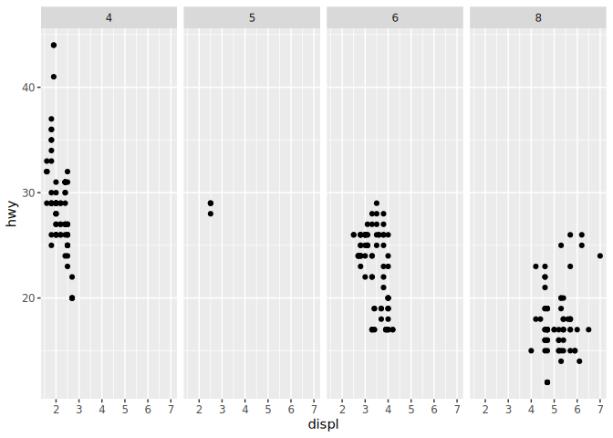
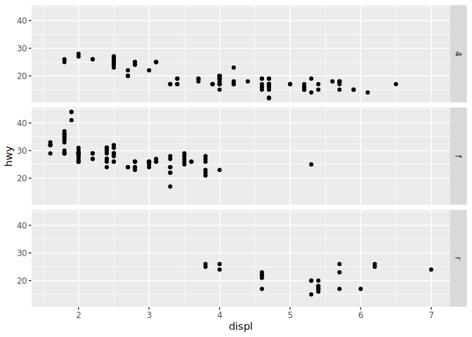
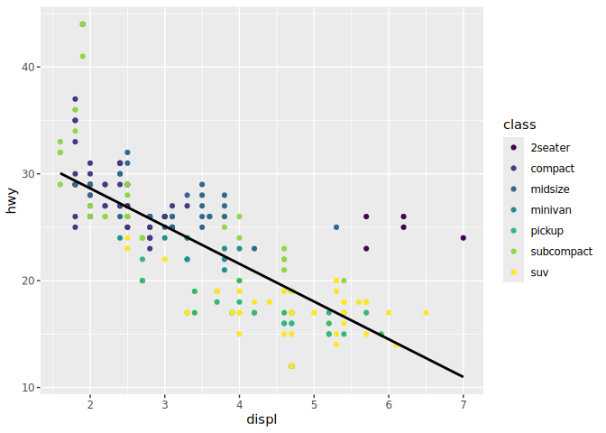

# Visualize Data
Erica Sherman

<!-- If you get the error "Error in list2(na.rm = na.rm, ...) : object 'ffi_list2' not found" do the following in the Console run:  
&#10;    remove.packages("rlang")
&#10;Then Restart R to be safe. Then run:
&#10;    install.packages("rlang")
&#10;and again restart R to be safe. That should fix the problem (which is a package dependency issue).   -->

Try your code again

## Your Turn 0

Add a setup chunk that loads the tidyverse packages.

``` r
library(tidyverse)
```

    ── Attaching core tidyverse packages ──────────────────────── tidyverse 2.0.0 ──
    ✔ dplyr     1.1.4     ✔ readr     2.1.5
    ✔ forcats   1.0.1     ✔ stringr   1.5.2
    ✔ ggplot2   4.0.0     ✔ tibble    3.3.0
    ✔ lubridate 1.9.4     ✔ tidyr     1.3.1
    ✔ purrr     1.1.0     
    ── Conflicts ────────────────────────────────────────── tidyverse_conflicts() ──
    ✖ dplyr::filter() masks stats::filter()
    ✖ dplyr::lag()    masks stats::lag()
    ℹ Use the conflicted package (<http://conflicted.r-lib.org/>) to force all conflicts to become errors

``` r
head(mpg)
```

    # A tibble: 6 × 11
      manufacturer model displ  year   cyl trans      drv     cty   hwy fl    class 
      <chr>        <chr> <dbl> <int> <int> <chr>      <chr> <int> <int> <chr> <chr> 
    1 audi         a4      1.8  1999     4 auto(l5)   f        18    29 p     compa…
    2 audi         a4      1.8  1999     4 manual(m5) f        21    29 p     compa…
    3 audi         a4      2    2008     4 manual(m6) f        20    31 p     compa…
    4 audi         a4      2    2008     4 auto(av)   f        21    30 p     compa…
    5 audi         a4      2.8  1999     6 auto(l5)   f        16    26 p     compa…
    6 audi         a4      2.8  1999     6 manual(m5) f        18    26 p     compa…

## Your Turn 1

Run the code on the slide to make a graph. Pay strict attention to
spelling, capitalization, and parentheses!

``` r
ggplot(mpg)+ # makes a blank plot
  geom_point(aes(x=displ,
                 y=hwy)) #geom_point makes a scatterplot, mapping aesthetics displ and hwy to x and y. geometry is scatterplot
```


## Your Turn 2

Replace this scatterplot with one that draws boxplots. Use the
cheatsheet. Try your best guess.

``` r
ggplot(data = mpg) +
  geom_boxplot(mapping = aes(x = class, y = hwy))
```


## Your Turn 3

Make a histogram of the `hwy` variable from `mpg`. Hint: do not supply a
y variable.

``` r
ggplot(mpg)+
  geom_histogram(aes(x=hwy))
```

    `stat_bin()` using `bins = 30`. Pick better value `binwidth`.


## Your Turn 4

Use the help page for `geom_histogram` to make the bins 2 units wide.

``` r
ggplot(mpg)+
  geom_histogram(aes(x=hwy),
                 binwidth = 2,
                 alpha=2, #transparency of the color
                 fill="lightblue", #fills the bars
                 color="blue") #outlines the bars
```


## Your Turn 5

Add `color`, `size`, `alpha`, and `shape` aesthetics to your graph.
Experiment.

``` r
ggplot(data = mpg) +
  geom_point(mapping = aes(x = displ, 
                           y = hwy,
                           color= class))+
  labs(x="Engine size Displacement",
       y="Highway Mileage (mpg)",
       title= "The Bigger the Engine The Less Mileage We Get on The Freeway",
       color="Class of Vehicle") +
  theme_light()
```


## Help Me

What do `facet_grid()` and `facet_wrap()` do? (run the code, interpret,
convince your group)

``` r
# Makes a plot that the commands below will modify
q <- ggplot(mpg) + geom_point(aes(x = displ, y = hwy))

q + facet_grid(. ~ cyl) # 4 columns based on cyl
```



``` r
q + facet_grid(drv ~ .) # 3rows of dev
```



``` r
q + facet_grid(drv ~ cyl) #3 rows drv, 4 columns cyl
```


``` r
q + facet_wrap(~ class) #each class
```


## Your Turn 6

Make a bar chart `class` colored by `class`. Use the help page for
`geom_bar` to choose a “color” aesthetic for class.

``` r
ggplot(mpg) +
  geom_bar(aes(x=class, fill=drv),
           position = "dodge") +
  labs(x= "Class of Vehicle",
       y= "Count of Vehicles in Sample",
       fill= "Type of Drive")+
  theme_bw()
```


## Quiz

What will this code do?

``` r
ggplot(mpg, aes(x=displ, y=hwy)) + 
  geom_point(aes(color=class)) +
  geom_smooth(color="black",
              se=FALSE,
              method = "lm") +
  scale_color_viridis_d()
```

    `geom_smooth()` using formula = 'y ~ x'



``` r
#ggsave("example.jpg", width = 6, height= 4)
#adds smooth line and points to the plot
```

------------------------------------------------------------------------

# Take aways

You can use this starter code template to make thousands of graphs with
**ggplot2**.

\#\| label: template \#\| eval: FALSE \#ggplot(data = <DATA>) + \#
<GEOM_FUNCTION>(mapping= aes(<MAPPINGS>))
